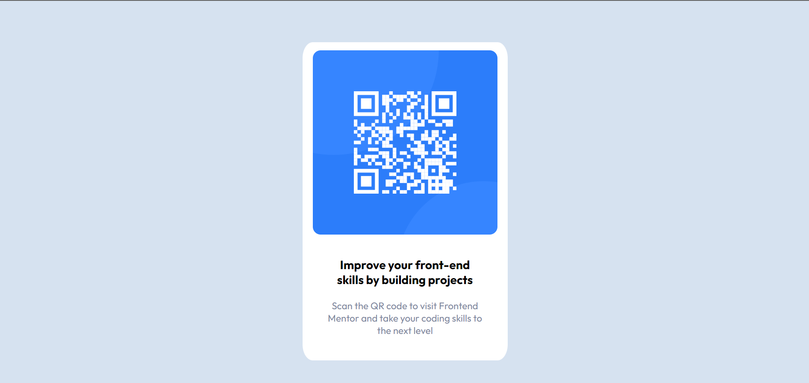

# Frontend Mentor - QR code component solution

This is a solution to the [QR code component challenge on Frontend Mentor](https://www.frontendmentor.io/challenges/qr-code-component-iux_sIO_H). Frontend Mentor challenges help you improve your coding skills by building realistic projects.

## Table of contents

- [Overview](#overview)
  - [Screenshot](#screenshot)
  - [Links](#links)
- [My process](#my-process)
  - [Built with](#built-with)
  - [What I learned](#what-i-learned)
- [Author](#author)

## Overview

### Screenshot

### Links

- Solution URL: [Solution Repository](https://github.com/Krishnanand2517/qr-code-component)
- Live Site URL: [Live Site](https://krishnanand2517.github.io/qr-code-component/)

## My process

### Built with

- HTML5
- CSS3

### What I learned

I got a nice and quick practice of basic HTML and CSS. After the challenge, I have become more comfortable using HTML and CSS.

## Author

- Frontend Mentor - [@Krishnanand2517](https://www.frontendmentor.io/profile/Krishnanand2517)
- github - [@Krishnanand2517](https://github.com/Krishnanand2517)
